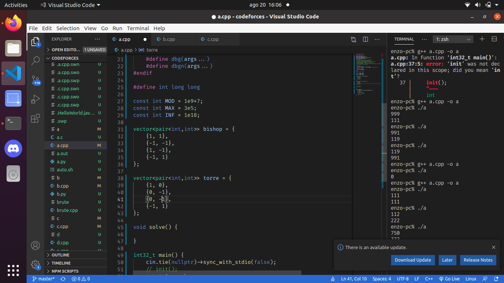

# PIBIT

Atualmente o script busca os standings em um contest de um grupo privado e transforma os dados dos standings em um arquivo csv.

## Como usar

Use a linha de comando:

**python3 standings.py**

Informe as chaves privadas e o Id do contest desejado e ele irá colocar as informações no arquivo parsed.csv

Caso o programa esteja quebrando por falta de alguma biblioteca, digite no terminal:

**pip install -r requirements.txt**

